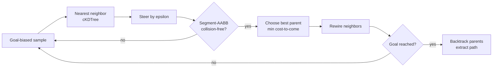
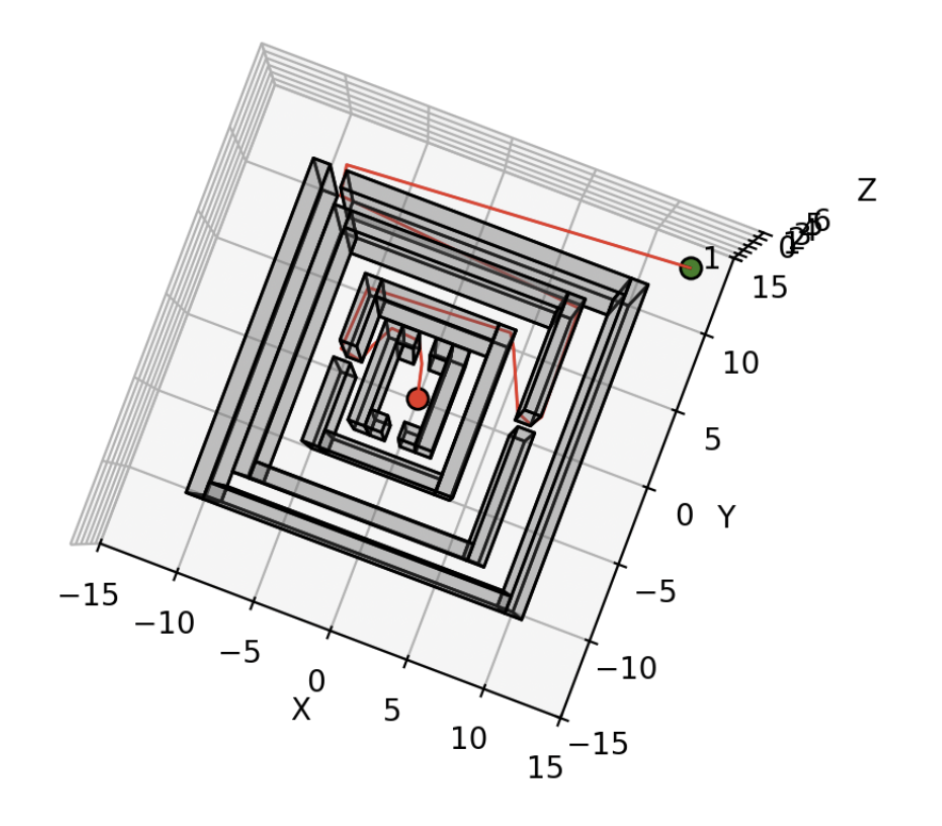
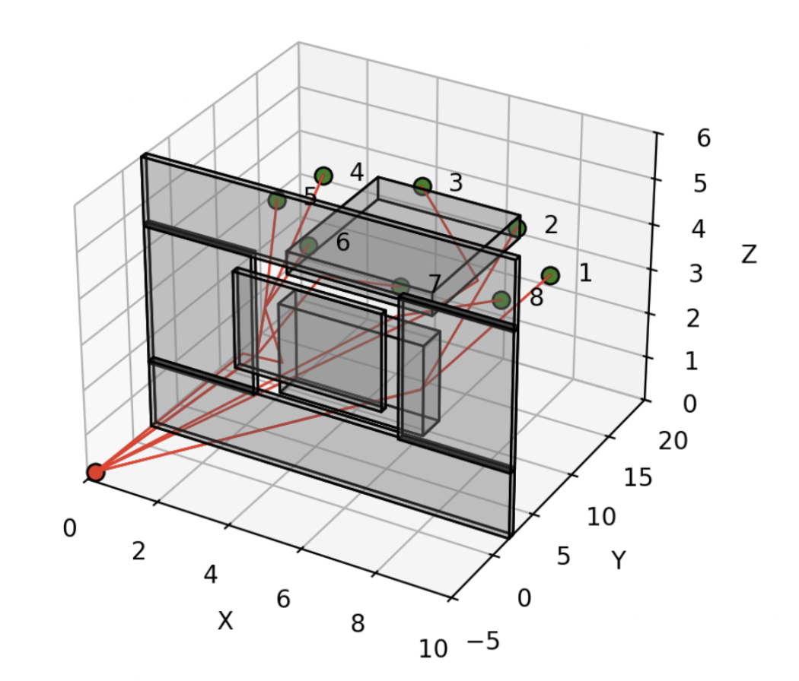

<div align="center">

# Motion Planning — RRT\* in 3-D

**A single sampling-based planner that finds collision-free paths through continuous 3-D environments — handling both fixed goals and dynamic goals that move through a sequence of targets, with tree reuse for fast replanning.**


</div>

---

## Overview

The robot is modeled as a point moving through a continuous 3-D Euclidean space bounded by a rectangular boundary and populated with axis-aligned rectangular obstacle blocks. The task is to compute collision-free paths from a start to a goal while avoiding every obstacle — using **one planner** that works for two settings:

- **Static goals** — a single path to one fixed target.
- **Dynamic goals** — the target appears at eight positions in sequence, and the planner reaches each one in turn.

The core is **RRT\*** with continuous line-segment collision checking against axis-aligned bounding boxes (AABBs). For dynamic goals, the planner **reuses the existing RRT\* tree** across queries rather than rebuilding it for each new target — since the obstacle map is fixed, previously sampled free-space nodes stay valid and later queries resolve faster.

Full method and results are in [`Report.pdf`](./Report.pdf).

## How it works



Each tree node stores its 3-D coordinate, a pointer to its parent, and `g`, the cost-to-come from the start. Nearest-neighbor lookups use a `scipy.spatial.cKDTree`, and steering extends the tree by a fixed step size `epsilon` toward each sample.

### Collision checking

Edges are checked **continuously**, not just at their endpoints — two endpoints can be collision-free while the segment between them clips an obstacle. Each candidate edge is treated as a line segment and tested against every obstacle AABB using a slab-based segment–box intersection test; any intersecting edge is rejected.

### Dynamic replanning

For the dynamic environments the same planner object persists across all eight goals, keeping its node list, coordinates, and kD-tree. Each new goal is reached by extending the already-explored tree, which makes later queries faster than planning from scratch.

## Repository structure

| Path | Role |
| --- | --- |
| `main.py` | Test, evaluation, and visualization entry point — loads maps, runs the planner, validates paths, records metrics, and generates plots. |
| `Planner.py` | The RRT\* implementation: goal-biased sampling, nearest-neighbor search, steering, collision checking, best-parent selection, rewiring, path extraction, and tree reuse. |
| `maps/` | The seven test environments (rectangular boundary + obstacle blocks). |
| `Report.pdf` | Technical report with methods and results. |

### Environments

| Static goal | Dynamic goal |
| --- | --- |
| `flappy_bird`, `maze`, `monza`, `single_cube`, `tower` | `window`, `room` (target moves through eight goal positions) |

## Getting started

### Dependencies

```bash
pip install numpy matplotlib scipy
```

### Run

```bash
python3 main.py
```

Which tests run is controlled by the `if __name__ == "__main__":` block — enable any of the static tests (e.g. `test_maze()`) or dynamic experiments (`experiment_window_dynamic()`, `experiment_room_dynamic()`).

### Parameters

The reported runs use steering step `epsilon = 0.5`, goal-sampling probability `goal_bias = 0.1`, and `max_iter = 100000`. A sweep also explored `epsilon ∈ {0.25, 0.5, 1.0}`, `goal_bias ∈ {0.05, 0.1, 0.2}`, and `max_iter ∈ {10000, 50000, 100000}`.

## Results

A static-goal solution and a dynamic-goal run with sequential replanning:

<div align="center">

| Static goal | Dynamic goal |
| :---: | :---: |
|  |  |
| Single collision-free path to a fixed target. | Path reaching each of the moving targets via tree reuse. |

</div>

Static runs report success, path length, explored nodes, iterations, and runtime; dynamic runs additionally report timing success, cumulative runtime, and per-goal results. See [`Report.pdf`](./Report.pdf) for the full tables and 3-D / plane-projection visualizations.

## Acknowledgements

Developed as a project for a **UCSD ECE 276B: Planning & Learning in Robotics** course.
